# GuideBox

A live TV guide for Roku. Point it at an M3U playlist and an XMLTV guide and you get a channel guide
with a picture-in-picture preview and a fullscreen player. Written in plain BrightScript / SceneGraph.

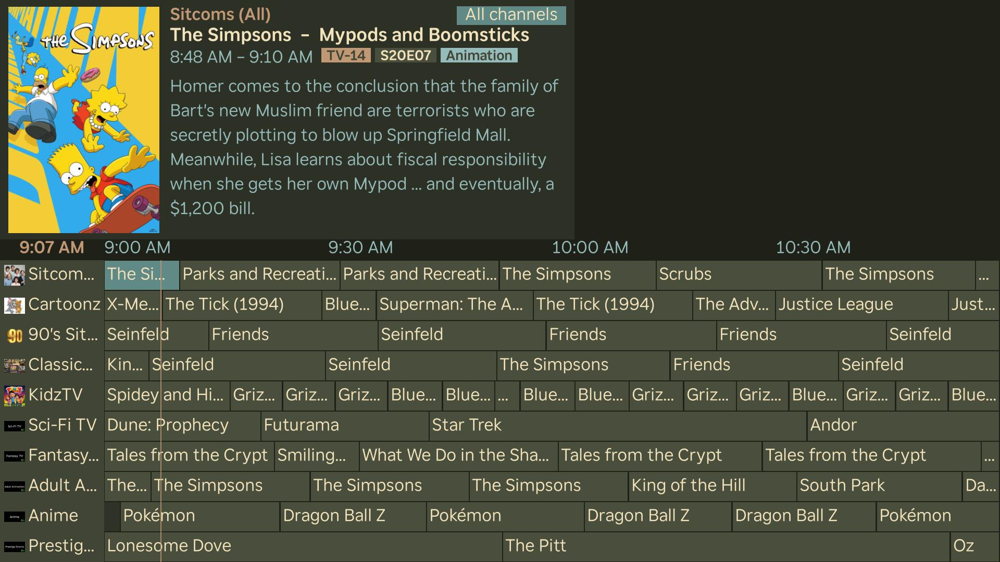

> **Note:** This app is totally created with [Claude Code](https://claude.com/claude-code) but has been tested
> by me on several Rokus. I am a software engineer but I have never done anything with BrightScript, so my
> reviews were pretty pointless and likely didn't make things better. The app does work great, though.

## Features

- Guide grid with a live preview of the current channel and details of the selected show (poster, rating, episode, genres)
- Any number of M3U + XMLTV sources, in the order you choose
- "On now" filters: Sports, Football, Soccer, Movies, Kids, News and more, plus Favorites
- Hold OK on a channel to set a reminder, favorite it, hide it, or record it (with [Dispatcharr](https://github.com/Dispatcharr/Dispatcharr))
- Guide and stream URLs refresh in the background
- Channels whose streams the Roku can't play are hidden for 14 days, and can be retried from Settings

## Screenshots

| | |
|---|---|
| 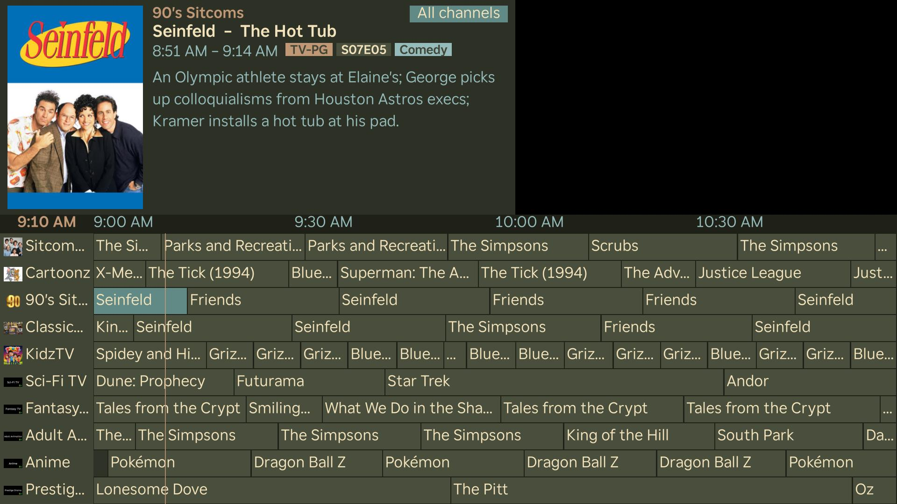 | 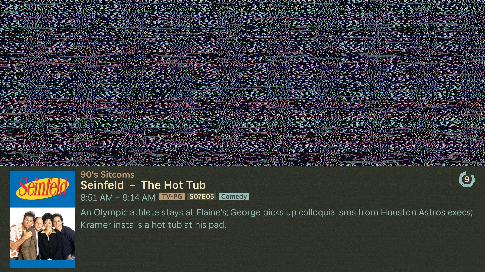 |
| 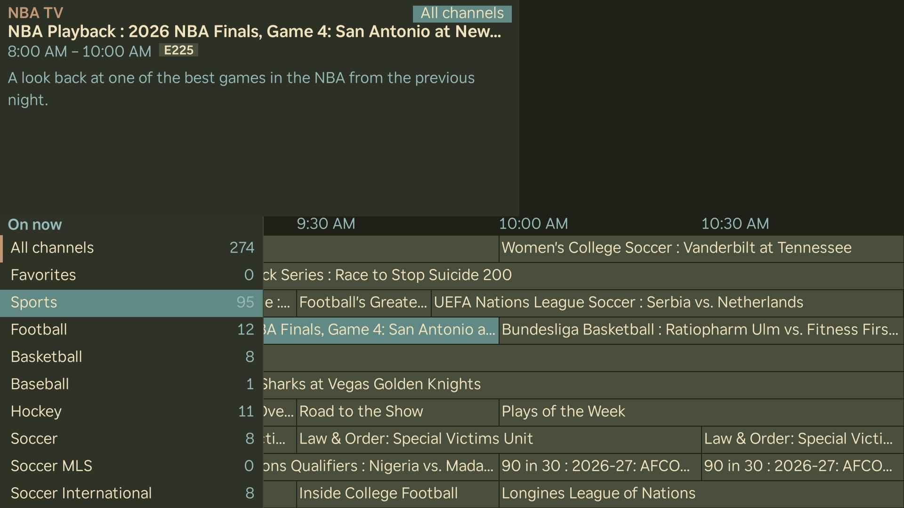 | 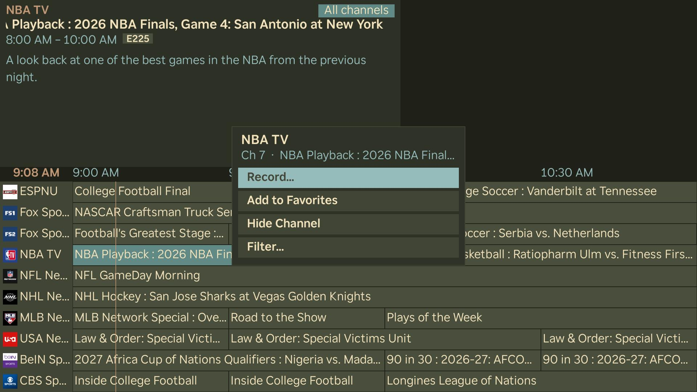 |
| 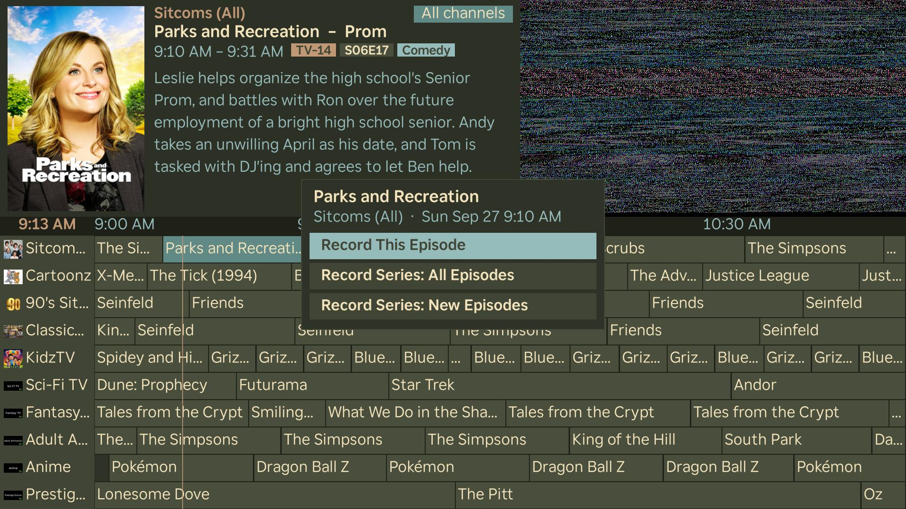 | 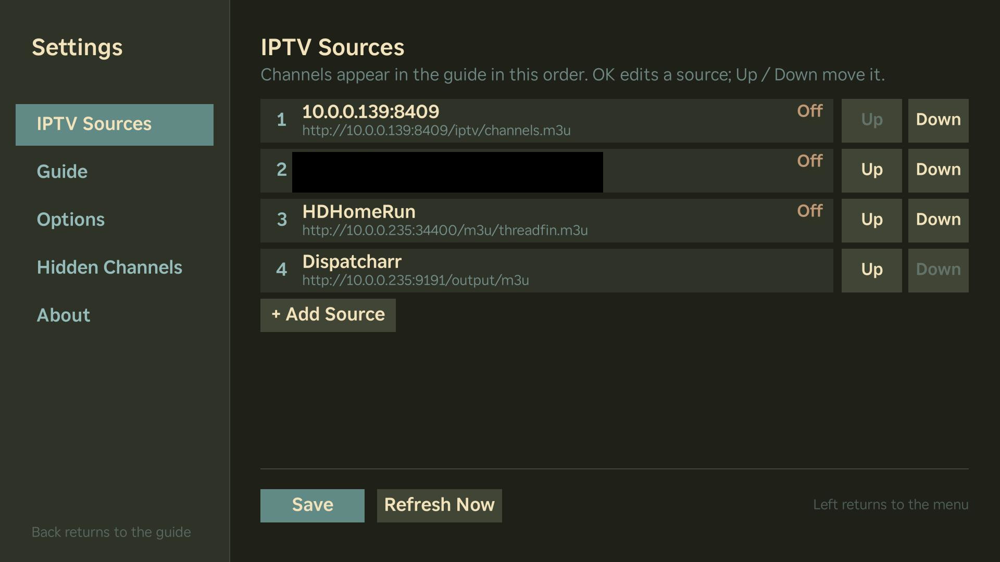 |
| 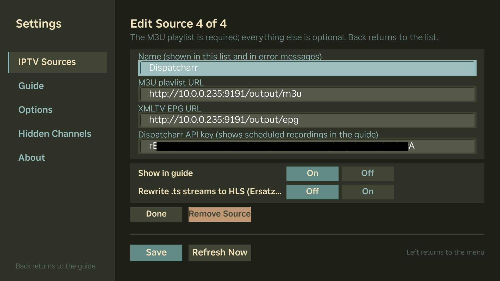 | 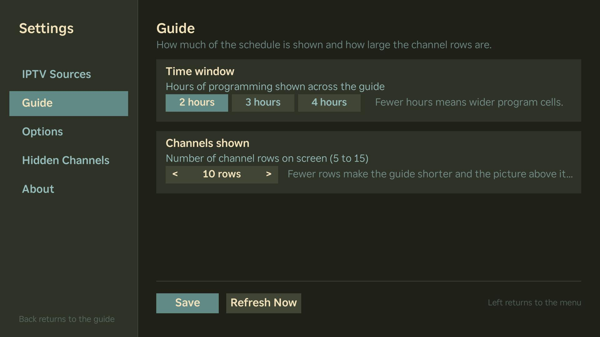 |
| 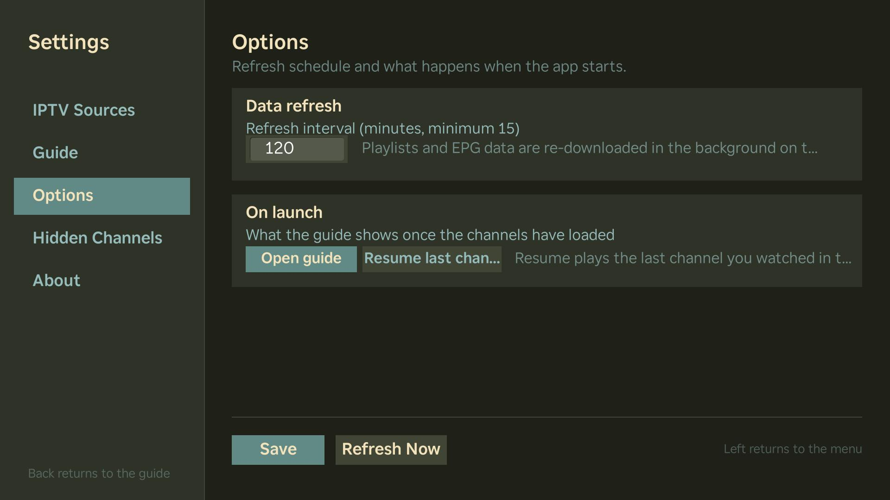 | 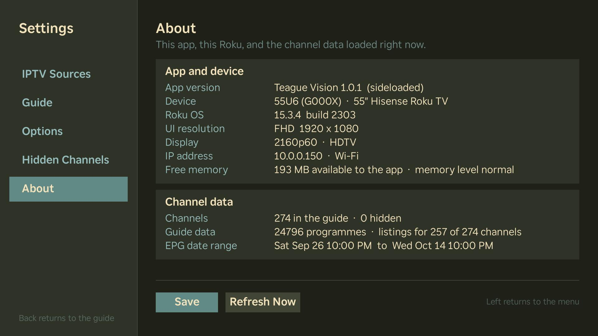 |

## Install

> **Note:** Roku doesn't accept IPTV player apps into its Channel Store, so GuideBox can't be published
> there. The only way to install it is to turn on developer mode and sideload it, as below.

### 1. Turn on developer mode

1. On the Roku remote, from the home screen press:
   **Home ×3, Up ×2, Right, Left, Right, Left, Right**
2. Accept the agreement, choose a **password**, and let the Roku restart.
3. Note the Roku's IP address: **Settings → Network → About**.

### 2. Build the package

From the repo root:

```bash
zip -r guidebox.zip manifest source components images
```

### 3. Upload it

1. In a browser, open `http://<roku-ip>` and log in as `rokudev` with your password.
2. Choose **Upload**, pick `guidebox.zip`, then **Install with zip**.

The app starts right away and stays on the home screen as the dev channel. A Roku holds one sideloaded
app at a time; uploading again replaces it.

### 4. Add your sources

On first launch Settings opens. Under **IPTV Sources**, add a source with your M3U playlist URL and
(optionally) its XMLTV guide URL, then **Save**.

### No provider? Try the demo playlist

Free public live streams with a made-up guide, republished daily (also what Roku's certification reviewers use):

- M3U playlist: `https://jteague.github.io/iptv-roku-github/demo.m3u`
- XMLTV guide: `https://jteague.github.io/iptv-roku-github/epg.xml`

The guide then shows three channels: DW English, DW Español and Unified Streaming Demo. Deep links work with
these channel ids: `curl -d '' "http://<roku-ip>:8060/launch/dev?contentId=dw-english&mediaType=live"`.

| | |
|---|---|
| 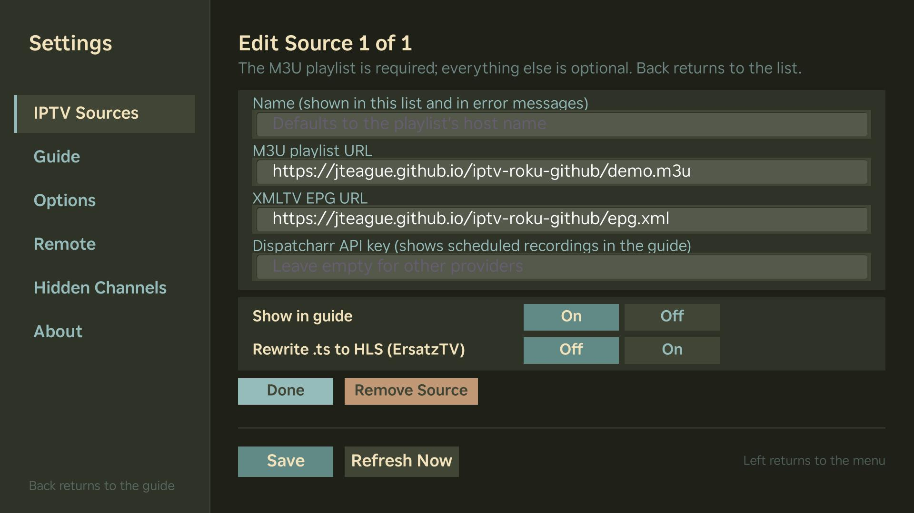 | 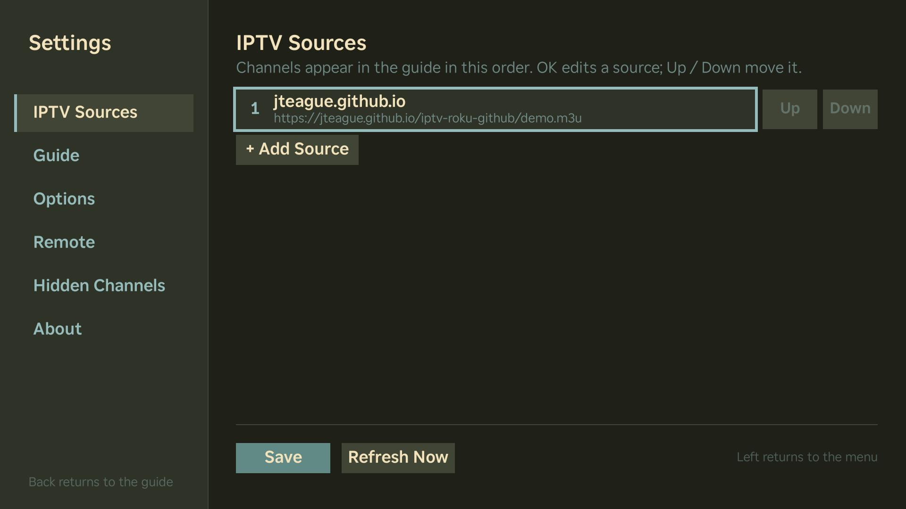 |
| 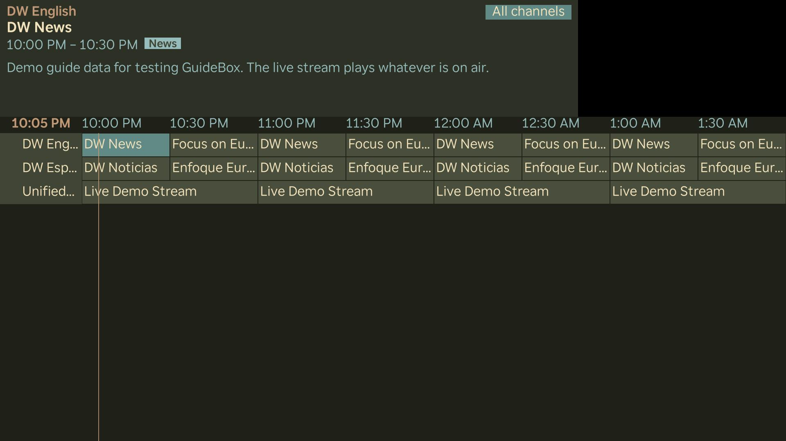 | 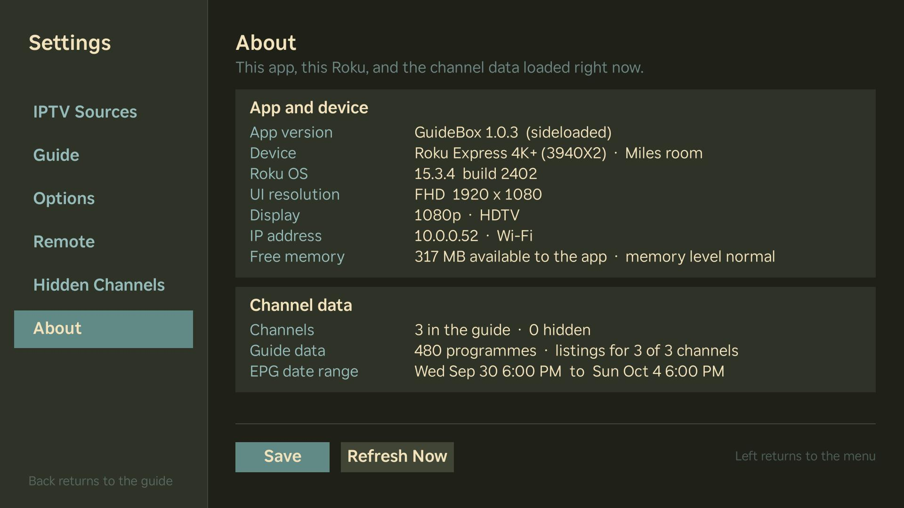 |

## Remote

| Key | Guide | Player |
|---|---|---|
| Up / Down | Change channel row | Up: show info · Down: last channel |
| Left / Right | Previous / next show | |
| OK | Watch channel | |
| Hold OK | Channel menu (remind, favorite, hide, record, filter) | |
| ↺ Replay | Filters | |
| ✱ Options | Settings | |
| ⏪ / ⏩ | Page up / down | |
| Back | Back to the player | Back to the guide |

## Development

The [BrightScript Language](https://marketplace.visualstudio.com/items?itemName=RokuCommunity.brightscript)
extension for VS Code deploys and debugs with F5. Create `.vscode/launch.json` with your Roku's IP and
the developer mode password (add one configuration per Roku to pick between them):

```json
{
  "version": "0.2.0",
  "configurations": [
    {
      "name": "Roku: Living Room",
      "type": "brightscript",
      "request": "launch",
      "host": "192.168.1.50",
      "password": "your-dev-password",
      "rootDir": "${workspaceFolder}",
      "files": ["manifest", "source/**/*", "components/**/*", "images/**/*"],
      "stopOnEntry": false
    }
  ]
}
```

Without VS Code, `print` output is on `telnet <roku-ip> 8085`.

Static check:

```bash
npm install
npx bsc --rootDir . --createPackage false --copyToStaging false \
  --files manifest "source/**/*.brs" "components/**/*.brs" "components/**/*.xml"
```

## License

[PolyForm Noncommercial 1.0.0](LICENSE). You're free to use, change and share GuideBox for any
noncommercial purpose. Selling it, or anything built from it, is not allowed.
